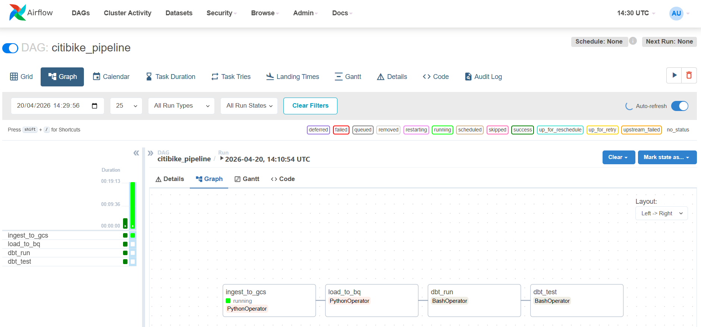

# 🚲 Citi Bike Pipeline (Overview)

This repo demonstrates a modern **batch ELT pipeline on Google Cloud**:

- **Raw data source**: Citi Bike monthly trip data (ZIP → CSV)
- **Data lake**: Google Cloud Storage (GCS)
- **Data warehouse**: BigQuery (raw + transformed datasets)
- **Transformations**: dbt models (staging + marts)
- **Orchestration**: Airflow (Docker Compose)
- **Infra**: Terraform provisions the bucket + dataset

If you want step-by-step setup/run instructions, use the technical runbook:

- `TECHNICAL_RUNBOOK.md`

---

## Airflow pipeline (DAG graph)

---

## Evaluation-aligned summary (what to look for)

This section maps the project to common evaluation areas (without scoring).

- **Problem description**: Turn raw Citi Bike trip files (monthly ZIP/CSV) into curated, analytics-ready tables for answering questions like ridership trends over time and usage patterns.
- **Cloud**: Pipeline components use Google Cloud (GCS for the lake, BigQuery for the warehouse). Core cloud resources are provisioned via Terraform.
- **Data ingestion (batch + orchestration)**: A batch pipeline orchestrated by Airflow runs ingestion → load → dbt run → dbt test, moving data from the public source into the lake and then into BigQuery.
- **Data warehouse**: Raw trips are loaded into BigQuery with partitioning and clustering to support the downstream query patterns used by the mart/dashboard.
- **Transformations**: dbt models build `staging` and `mart` datasets on top of the raw BigQuery table.
- **Dashboard**: The curated mart table(s) are designed to be connected to a BI tool (Looker Studio), with an example aggregate table (`agg_trips_by_month`) referenced below.
- **Reproducibility**: The repo includes a runbook (`TECHNICAL_RUNBOOK.md`) plus Docker Compose for Airflow, dbt project files, and Terraform for infra, so the pipeline can be reproduced end-to-end.

---

## What you get out of it

- A reproducible pipeline you can trigger from Airflow:
  - **Ingest** → **Load to BigQuery** → **dbt run** → **dbt test**
- BigQuery tables suitable for BI (Looker Studio / Tableau / etc.)

---

## Design notes (intentional choices)

- **Why we don’t use PySpark**: The dataset size and transformations in this project are well served by Python + BigQuery + dbt. Introducing Spark would add operational overhead (cluster/runtime, packaging, debugging) that is **overkill** for the scale and would not improve the learning goals.
- **Why Airflow has no schedule**: The DAG is meant to be run **on-demand** (manual trigger) instead of on a recurring schedule. This avoids unexpected cloud spend while working under a GCP trial that is close to expiring.

---

## High-level data flow

1. Download monthly ZIP archives from `BASE_URL`
2. Extract CSV files and upload to `gs://<bucket>/raw/<month>/...`
3. Load into BigQuery: `<project>.<dataset>.trips_raw` (partitioned + clustered)
4. Transform using dbt into:
   - `staging.*` (cleaned trips)
   - `mart.*` (facts + aggregates)
5. Visualize through Looker Studio using the data mart above (the repo references `agg_trips_by_month`)

---

## Where to look

- **Infrastructure**: `terraform/`
- **Ingestion + load**: `ingestion/`
- **Transformations**: `dbt/`
- **Orchestration**: `airflow/`
- **Dashboard assets**: `dashboard/`

